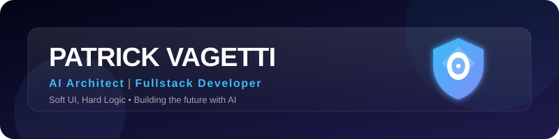

# 👋 Olá, eu sou o Patrick | @DevFalconszz

  

  
  

---

### ✨ Sobre a minha essência

Sou um desenvolvedor **polímata** com raízes sólidas em **Game Development** e **Sistemas de Performance**, agora liderando inovações na fronteira da **Inteligência Artificial** e **Automação de Marketing**. Meu código é guiado pela filosofia de que a tecnologia deve ser invisível e eficiente: poderosa por dentro, mas elegante e "soft" por fora.

- 🤖 **IA & Automação:** Arquiteto de soluções que integram Visão Computacional, LLMs e automações de workflow.
- 🚀 **Marketing Intelligence:** Desenvolvedor da plataforma **M.I. (Marketing Ignition)**, focada em escala e inteligência de dados.
- 🎮 **GameDev Heritage:** Experiência em C++ e C# (Unity/SDL2) com foco em otimização de baixo nível.
- 🎓 **Fator Humano:** Utilizo teorias de mediação cognitiva para criar interfaces que facilitam a vida e potencializam o aprendizado.

---

### 🚀 Projetos em Destaque

#### [🌐 M.I. - Marketing Ignition](https://www.mi-corp.com.br/)
Minha principal frente de atuação em inteligência de mercado. Uma plataforma robusta voltada para automação, escala e ignição de marketing digital, unindo tecnologia de ponta e estratégia.

#### [🤖 Áquila IA (Projeto Pessoal)](https://github.com/DevFalconszz/aquila-tcc)
Um assistente autônomo de código aberto que integra **visão computacional** e **voz humana (Piper)** para interagir com o ambiente desktop de forma inteligente.

#### [🧪 Mundo dos Isômeros](https://github.com/DevFalconsz/Mundo-dos-Isomeros) *(Legacy)*
Um projeto premiado de gamificação educacional que traduz conceitos complexos de Química Orgânica através de mecânicas interativas.

---

### 🛠️ Minha Stack Completa

| Categoria | Tecnologias |
| :--- | :--- |
| **Inteligência Artificial** | Ollama, LLMs (Qwen/Llama), LangChain, RAG, Visão Computacional. |
| **Web & Back-end** | Python (Django), TypeScript (Node.js), React, Vercel, PHP. |
| **Performance & Games** | C++, C# (Unity), SDL2, SFML, Blender. |
| **Automação & Infra** | Linux (Ubuntu), SSH Automation, Bash/Shell, DNS Management. |

---

### 📫 Conecte-se comigo

  
  

  <i>"Soft UI, Hard Logic. Criando o amanhã através de linhas de código e neurônios artificiais."</i> 
  <b>DevFalconszz</b>

